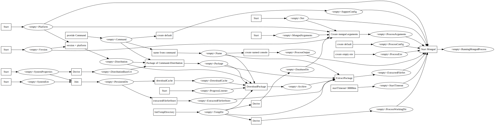
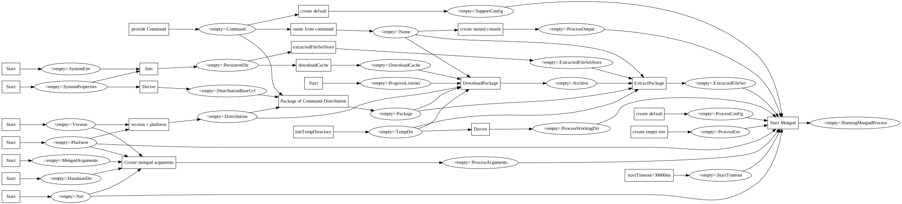
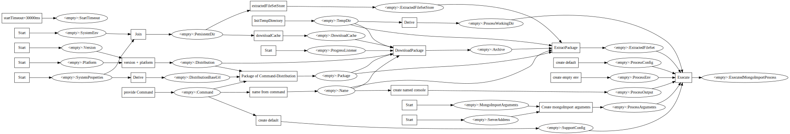
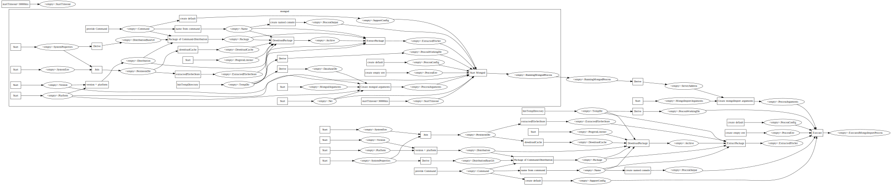
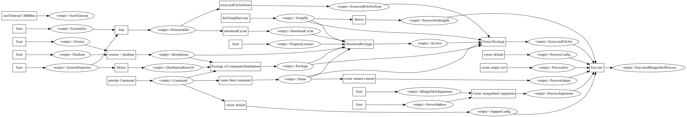

# Use Cases

## start mongod                                       

```java
Transitions transitions = Mongod.instance().transitions(version);

try (TransitionWalker.ReachedState<RunningMongodProcess> running = transitions.walker()
  .initState(StateID.of(RunningMongodProcess.class))) {

  com.mongodb.ServerAddress serverAddress = serverAddress(running.current().getServerAddress());
  try (MongoClient mongo = MongoClients.create("mongodb://" + serverAddress)) {
...

  }
}

```



## start mongod with persistent database

```java
Transitions transitions = Mongod.instance()
  .withDatabaseDir(Start.to(DatabaseDir.class)
    .initializedWith(DatabaseDir.of(persistentDir)))
  .transitions(version);

try (TransitionWalker.ReachedState<RunningMongodProcess> running = transitions.walker()
  .initState(StateID.of(RunningMongodProcess.class))) {

  com.mongodb.ServerAddress serverAddress = serverAddress(running.current().getServerAddress());
  try (MongoClient mongo = MongoClients.create("mongodb://" + serverAddress)) {
    MongoDatabase db = mongo.getDatabase("test");
    MongoCollection<Document> col = db.getCollection("testCol");
    col.insertOne(new Document("testDoc", new Date()));
    assertThat(col.countDocuments()).isEqualTo(1L);
  }
}

try (TransitionWalker.ReachedState<RunningMongodProcess> running = transitions.walker()
  .initState(StateID.of(RunningMongodProcess.class))) {

  com.mongodb.ServerAddress serverAddress = serverAddress(running.current().getServerAddress());
  try (MongoClient mongo = MongoClients.create("mongodb://" + serverAddress)) {
    MongoDatabase db = mongo.getDatabase("test");
    MongoCollection<Document> col = db.getCollection("testCol");
    assertThat(col.countDocuments()).isEqualTo(1L);
  }
}

```


               
## json import with mongoimport into mongod

```java
MongoImportArguments arguments = MongoImportArguments.builder()
  .databaseName("importDatabase")
  .collectionName("importCollection")
  .importFile(Resources.getResource("sample.json").getFile())
  .isJsonArray(true)
  .upsertDocuments(true)
  .build();

try (TransitionWalker.ReachedState<RunningMongodProcess> mongoD = Mongod.instance().transitions(version)
  .walker()
  .initState(StateID.of(RunningMongodProcess.class))) {

  Transitions mongoImportTransitions = MongoImport.instance()
    .transitions(version)
    .replace(Start.to(MongoImportArguments.class).initializedWith(arguments))
    .addAll(Start.to(ServerAddress.class).initializedWith(mongoD.current().getServerAddress()));

  try (TransitionWalker.ReachedState<ExecutedMongoImportProcess> executed = mongoImportTransitions.walker()
    .initState(StateID.of(ExecutedMongoImportProcess.class))) {
...

  }

  com.mongodb.ServerAddress serverAddress = serverAddress(mongoD.current().getServerAddress());
  try (MongoClient mongo = MongoClients.create("mongodb://" + serverAddress)) {
    MongoDatabase db = mongo.getDatabase("importDatabase");
    MongoCollection<Document> col = db.getCollection("importCollection");

    ArrayList<String> names = col.find()
      .map(doc -> doc.getString("name"))
      .into(new ArrayList<>());

    assertThat(names).containsExactlyInAnyOrder("Cassandra", "HBase", "MongoDB");
  }
}
```



## json import with mongoimport into mongod - compact version

```java
ImmutableMongoImportArguments arguments = MongoImportArguments.builder()
  .databaseName("importDatabase")
  .collectionName("importCollection")
  .importFile(Resources.getResource("sample.json").getFile())
  .isJsonArray(true)
  .upsertDocuments(true)
  .build();

Transitions mongoImportTransitions = MongoImport.instance().transitions(version)
  .replace(Start.to(MongoImportArguments.class).initializedWith(arguments))
  .addAll(Derive.given(RunningMongodProcess.class).state(ServerAddress.class)
    .deriveBy(Try.function(RunningMongodProcess::getServerAddress).mapToUncheckedException(RuntimeException::new)))
  .addAll(Mongod.instance().transitions(version).walker()
    .asTransitionTo(TransitionMapping.builder("mongod", StateID.of(RunningMongodProcess.class))
      .build()));

try (TransitionWalker.ReachedState<RunningMongodProcess> mongoD = mongoImportTransitions.walker()
  .initState(StateID.of(RunningMongodProcess.class))) {

  try (TransitionWalker.ReachedState<ExecutedMongoImportProcess> running = mongoD.initState(StateID.of(ExecutedMongoImportProcess.class))) {
...

  }

  com.mongodb.ServerAddress serverAddress = serverAddress(mongoD.current().getServerAddress());
  try (MongoClient mongo = MongoClients.create("mongodb://" + serverAddress)) {
    MongoDatabase db = mongo.getDatabase("importDatabase");
    MongoCollection<Document> col = db.getCollection("importCollection");

    ArrayList<String> names = col.find()
      .map(doc -> doc.getString("name"))
      .into(new ArrayList<>());

    assertThat(names).containsExactlyInAnyOrder("Cassandra", "HBase", "MongoDB");
  }
}
```




## execute mongo shell with running mongod server

```java
String script = "db.mongoShellTest.insertOne( { name: 'a' } );\n"
  + "db.mongoShellTest.insertOne( { name: 'B' } );\n"
  + "db.mongoShellTest.insertOne( { name: 'cc' } );\n";

Path scriptFile = Files.createTempFile(tempDir, "mongoshell", "");
Files.write(scriptFile, script.getBytes(StandardCharsets.UTF_8), StandardOpenOption.TRUNCATE_EXISTING);

ImmutableMongoShellArguments mongoShellArguments = MongoShellArguments.builder()
  .dbName("db")
  .scriptName(scriptFile.toAbsolutePath().toString())
  .build();

try (TransitionWalker.ReachedState<RunningMongodProcess> mongoD = Mongod.instance().transitions(version)
  .walker()
  .initState(StateID.of(RunningMongodProcess.class))) {

  // mongo shell support removed with version >=6.x.x
  Transitions mongoShellTransitions = MongoShell.instance().transitions(Version.Main.V5_0)
    .replace(Start.to(MongoShellArguments.class)
      .initializedWith(mongoShellArguments))
    .addAll(Start.to(ServerAddress.class).initializedWith(mongoD.current().getServerAddress()));

  try (TransitionWalker.ReachedState<ExecutedMongoShellProcess> executed = mongoShellTransitions.walker()
    .initState(StateID.of(ExecutedMongoShellProcess.class))) {
...

  }

  com.mongodb.ServerAddress serverAddress = serverAddress(mongoD.current().getServerAddress());
  try (MongoClient mongo = MongoClients.create("mongodb://" + serverAddress)) {
    MongoDatabase db = mongo.getDatabase("db");
    MongoCollection<Document> col = db.getCollection("mongoShellTest");

    ArrayList<String> names = col.find()
      .map(doc -> doc.getString("name"))
      .into(new ArrayList<>());

    assertThat(names).containsExactlyInAnyOrder("a", "B", "cc");
  }
}
```

